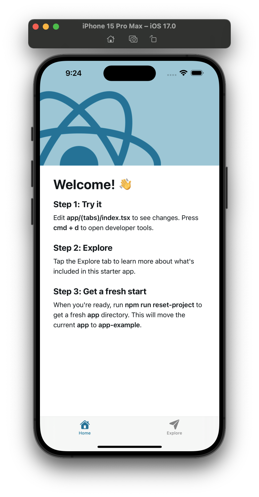
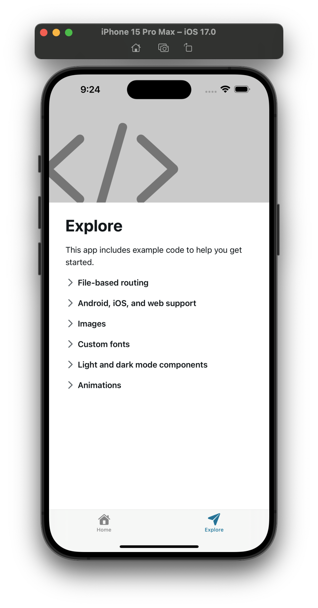
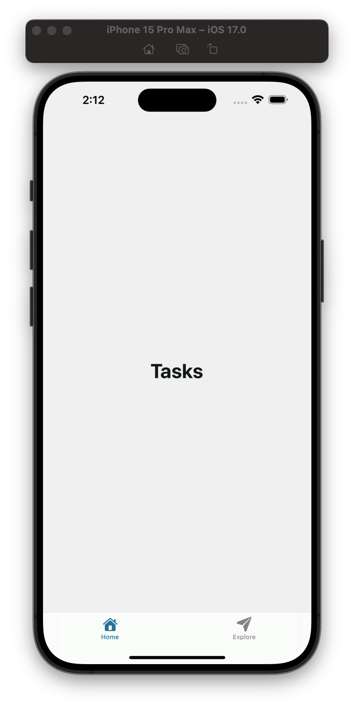

*Concepts you may want to Google beforehand: bash, terminal, shell, vscode, cursor, ide, create-expo-app, metro bundler, sqlite, tinybase*

**Goal: Create an Expo app and install dependencies.**

## Create Project Folders
1. Create a new folder for your project in an integrated Bash terminal in [VSCode](https://code.visualstudio.com/download), [Cursor](https://www.cursor.com/), or another IDE (integrated development environment) of your choice:
```bash
$ mkdir name-of-your-project
```
2. Access the newly created folder:
```bash
$ cd name-of-your-project
```
3. Create two folders: one for the `client` and one for the `server`:
```bash
$ mkdir client server
```

## Create Expo App
1. Use the `npx` command to create a new Expo app:
```bash
$ npx create-expo-app@latest .
```
2. If you are asked in the terminal "Ok to proceed?" for the installation of package `create-expo-app`, press "Y" and then "Enter/Return":
```bash
$ npx create-expo@latest .
Need to install the following packages:
create-expo-app@3.2.0
Ok to proceed? (y)
```

## Run the Expo App on Device
1. Start Metro Bundler:
```bash
$ npx expo start
```
2. Access the app on device(s) with Expo Go or on simulator(s)/emulator(s) once the Metro Bundler finishes loading.
You should see something like the following for the Home and Explore tabs respectively:
<div align="center">
    
    
</div>

## Install Dependencies
1. Focus on your terminal and press "Ctrl" and "C" keys simultaneously to stop the Expo client if it's still running.
2. Install Expo SQLite and Tinybase:
```bash
$ npx expo install expo-sqlite tinybase
```

## Replace Code While Running the Client
1. Run the client Expo app:
```bash
$ npx expo start
```
2. Load the app on device(s) with Expo Go or simulator(s)/emulator(s).
3. Navigate to `/client/app/(tabs)/index.tsx` in your project directory.
4. Press "Ctrl" and "A" simultaneously to highlight all code in `/client/app/(tabs)/index.tsx`.
5. Press "Backspace" or "Delete".
6. Type the following code into `/client/app/(tabs)/index.tsx`:
```typescript
// Used to contain elements in the UI
import { View } from "react-native";
// Custom light-and-dark-themed wrapper component around the React Native Text element
import { ThemedText } from "@/components/ThemedText";

// The main component for the Home screen
export default function HomeScreen() {
  // The main UI for the Home screen
  return (
    // The main container for the UI
    <View style={{ flex: 1, justifyContent: "center", alignItems: "center" }}>
      {/* The main title for the screen */}
      <ThemedText type="title">Tasks</ThemedText>
    </View>
  )
}
```
7. Reload the app on device(s) and simulator(s)/emulator(s) by pressing "R" in the terminal with the client running.
You should see something like the following for the Home tab:
<div align="center">
    
</div>