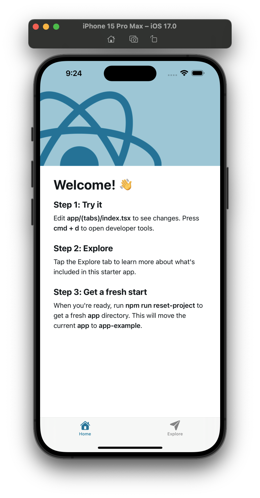
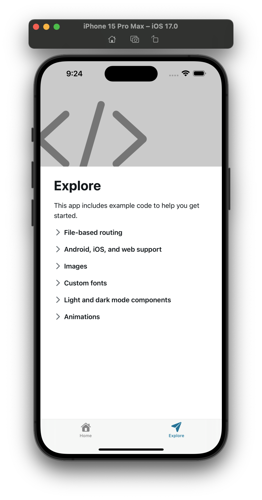

*Concepts you may want to Google beforehand: bash, terminal, shell, vscode, cursor, ide, create-expo-app, metro bundler, sqlite, tinybase*

**Goal: Create an Expo app and install dependencies.**

## Create Project Folders
1. Create a new folder for your project in a integrated Bash terminal in [VSCode](https://code.visualstudio.com/download), [Cursor](https://www.cursor.com/), or other IDE (integrated development environment) of your choice:
```bash
$ mkdir name-of-your-project
```
2. Access the newly created folder:
```bash
$ cd name-of-your-project
```
3. Create 2 folders: one for the `client` and one for the `server`:
```bash
$ mkdir client server
```

## Create Expo App
1. Use the `npx` command to create a new Expo app:
```bash
$ npx create-expo-app@latest .
```
2. If you are asked in the terminal "Ok to proceed?" for the installation of package `create-expo-app`, press "Y" and then "Enter/Return":
```bash
$ npx create-expo@latest .
Need to install the following packages:
create-expo-app@3.2.0
Ok to proceed? (y)
```

## Run the Expo App on Device
1. Start Metro Bundler:
```bash
$ npx expo start
```
2. Access the app on your device with Expo Go or on a simulator/emulator once the Metro Bundler finishes loading.
You should see something like the following for the Home and Explore tabs respectively:
<div align="center">
    
    
</div>

## Install Dependencies
1. Focus on your terminal and press "Control/Ctrl" and "C" keys simultaneously to stop the Expo app server if it's still running.
2. Install Expo SQLite and Tinybase:
```bash
$ npx expo install expo-sqlite tinybase
```