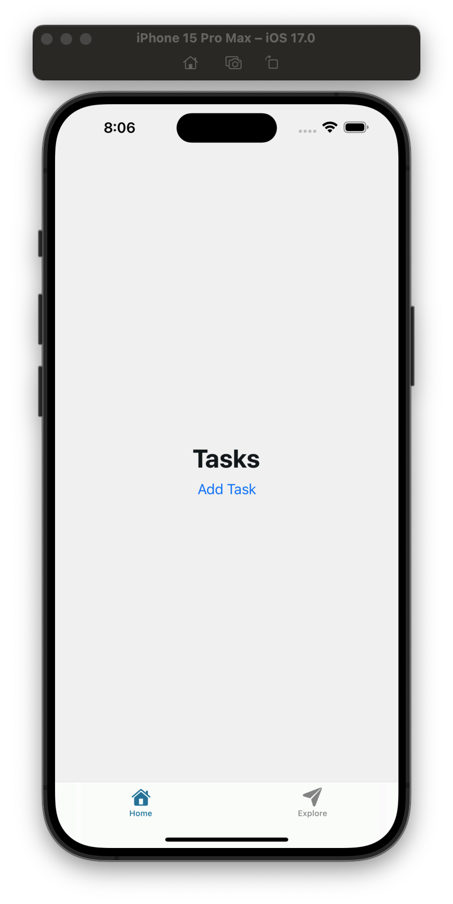

# TinyBase Store

*Concepts you may want to Google beforehand: mergeable store*

**Goal: Add a mergeable store and `AddTask` button component.**

## Add a Mergeable Store
1. Navigate to `/client/app/(tabs)/index.tsx`.
2. Add a mergeable store right before the `return` statement in the main `HomeScreen` functional component:
```typescript
// ...
// The main component for the Home screen
export default function HomeScreen() {
  // Add code here
  // The main UI for the Home screen
  return (
    // The main container for the UI
    <View style={{ flex: 1, justifyContent: "center", alignItems: "center" }}>
      {/* The main title for the screen */}
      <ThemedText type="title">Tasks</ThemedText>
    </View>
  )
}
```
```typescript
// ...
// The main component for the Home screen
export default function HomeScreen() {
  // Create a mergeable store
  const store = useCreateMergeableStore(() => createMergeableStore());
  // Add code here
  // The main UI for the Home screen
  return (
    // The main container for the UI
    <View style={{ flex: 1, justifyContent: "center", alignItems: "center" }}>
      {/* The main title for the screen */}
      <ThemedText type="title">Tasks</ThemedText>
    </View>
  )
}
```
3. Provide the store to the database table below the store definition:
```typescript
// ...
// The main component for the Home screen
export default function HomeScreen() {
  // Create a mergeable store
  const store = useCreateMergeableStore(() => createMergeableStore());
  // Provide the store to the table
  useProvideStore(TABLE_NAME, store);
  // The main UI for the Home screen
  return (
    // The main container for the UI
    <View style={{ flex: 1, justifyContent: "center", alignItems: "center" }}>
      {/* The main title for the screen */}
      <ThemedText type="title">Tasks</ThemedText>
    </View>
  )
}
``` 
4. Resolve any dependencies that weren't imported with your IDE:
```typescript
// Start of File
// Used to contain elements in the UI
import { View } from "react-native";
// Custom light-and-dark-themed wrapper component around the React Native Text element
import { ThemedText } from "@/components/ThemedText";
import { useCreateMergeableStore, useProvideStore } from "tinybase/ui-react";
import { createMergeableStore } from "tinybase/mergeable-store";
// ...
```

## Create and Use `AddTask` Button Component
1. Define an `AddTask` button component above the main `HomeScreen` functional component:
```typescript
// ...
// Add code here

/**
 * The main component for the Home screen
 * @returns A React Native component
 */
export default function HomeScreen() {
// ...
```
```typescript
/**
 * The `AddTask` button component
 * @returns A React Native component
 */
const AddTask = () => <Button title="Add Task" onPress={() => { }} />;

/**
 * The main component for the Home screen
 * @returns A React Native component
 */
export default function HomeScreen() {
```
2. Use the newly defined `AddTask` component in the main `HomeScreen` component:
```typescript
/**
 * The main component for the Home screen
 * @returns A React Native component
 */
export default function HomeScreen() {
  // Create a mergeable store
  const store = useCreateMergeableStore(() => createMergeableStore());
  // Provide the store to the table
  useProvideStore(TABLE_NAME, store);
  // The main UI for the Home screen
  return (
    // The main container for the UI
    <View style={{ flex: 1, justifyContent: "center", alignItems: "center" }}>
      {/* The main title for the screen */}
      <ThemedText type="title">Tasks</ThemedText>
      {/* Add code here */}
    </View>
  )
}
```
```typescript
/**
 * The main component for the Home screen
 * @returns A React Native component
 */
export default function HomeScreen() {
  // Create a mergeable store
  const store = useCreateMergeableStore(() => createMergeableStore());
  // Provide the store to the table
  useProvideStore(TABLE_NAME, store);
  // The main UI for the Home screen
  return (
    // The main container for the UI
    <View style={{ flex: 1, justifyContent: "center", alignItems: "center" }}>
      {/* The main title for the screen */}
      <ThemedText type="title">Tasks</ThemedText>
      <AddTask />
    </View>
  )
}
```
7. With the client running, you should see something like the following for the Home tab when you save your changes:
<div align="center">
    
</div>

[Previous: TinyBase Tables and Cells](/03-tinybase-tables-and-cells.md) • [Next: TinyBase Store Add Items](/05-tinybase-store-add-items.md)